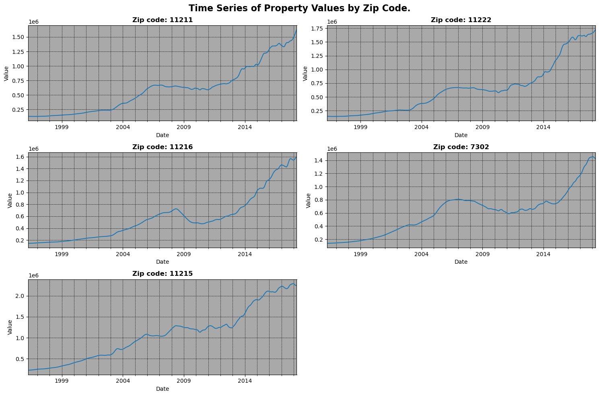

# Zillow Housing Data Time Series Modeling 🏘️.

### Team Members:

 1. Silvia Gworit
 2. Dennis Mwenda
 3. Myra Kadenge
 4. Paul Muniu
 
 
 ##  Project Overview
The real estate market is dynamic and constantly evolving. To stay competitive and profitable, real estate companies need to analyze market trends. Happy Homes Partners (our client), a real estate investor, recognizes the importance of data science in identifying lucrative investment opportunities and guiding clients towards profitable decisions.

### Table of Contents: 
1. Business Understanding 
2. Data Understanding
3. Data Preparation
4. Exploratory Data Analysis
5. Modeling
6. Conclusion
7. Recommendations
8. References

### Business Understanding
Happy Homes Partners aims to enhance their property investments by identifying optimal locations. Us as 'Tech to Tech Hub' we are tasked with supporting this goal using a comprehensive Zillow dataset (April 1996 to April 2018) to determine the top 5 zip codes with the highest investment potential.

### Business Problem
Identify the top 5 zip codes with the most promising investment potential for Happy Homes Partners.

### Objectives
**Main Objective:**
What are the top 5 best zip codes for Happy Homes Partners to invest in?

**Specific Objectives:**
1. Identify and establish the top 5 zip codes with the highest ROI.
2. Develop time series models to forecast real estate prices for various zip codes over different time horizons.
3. Evaluate the performance of these time series models using suitable metrics to ensure reliable and effective price predictions.

## Data Understanding

#### Summary of the Dataset
The dataset comprises 14,723 rows and 272 columns, mainly in wide format with date columns.

#### Data Ispection 
The dataset includes various data types and spans multiple zip codes and time periods.

## Data Preparation 

- Duplicates and Missing Values -
Handled duplicates and missing values to ensure data quality.

- Renaming and Conversion -
Standardized column names and data types.

- Feature Engineering - Return on Investment (ROI);
Calculated ROI for each zip code to identify top-performing areas.

- Checking for Outliers - 
Analyzed outliers to determine their impact on the dataset.

### Resampling
Data was resampled to different time intervals:

 **Monthly Data
 **Quarterly Data
 **Yearly Data
 
## Exploratory Data Analysis

#### Top 5 Zip Codes with Highest ROI
An analysis was conducted to identify and evaluate the top 5 zip codes with the highest Return on Investment (ROI).

#### Top 5 Zip Code Areas with High Growth Rate

## Modeling
**Time series for the top 5 zipcodes.**

### 1. Baseline Model: Simple Moving Average (SMA)
Initiated the analysis by establishing a baseline using the Simple Moving Average (SMA) model. This provided a foundational comparison for subsequent, more complex models.

### 2. ARIMA Modeling
Developed and fine-tuned ARIMA models to forecast housing prices. 

### 3. AutoARIMA Model
Leveraged the AutoARIMA technique for automatic parameter selection and model optimization. This approach facilitated efficient and accurate model fitting by automating the selection of the best ARIMA parameters.

### 4. Final Model: Facebook Prophet
Adopted Facebook Prophet as the final model for advanced time series forecasting. Prophet was chosen for its robustness in handling seasonality and trend components, offering enhanced forecasting accuracy.

## Conclusion.

### *Summary of Findings
Through this analysis, we identified the top 5 zip codes with the highest ROI, revealing promising investment opportunities for Happy Homes Partners. The exploration and modeling phases provided valuable insights into the real estate market trends and the potential for profitable investments.
### *Future Work
To further refine the investment strategy, additional factors such as economic indicators and demographic trends could be incorporated into future models.

### *Final Thoughts
This project underscores the importance of leveraging data science to make informed real estate investment decisions. The insights gained from the time series analysis provide a solid foundation for strategic planning & investment optimization in the dynamic real estate market.

### References.
1.https://facebook.github.io/prophet/docs/quick_start.html

2.https://github.com/PMEAL/pmdarima

3.https://scikit-learn.org/stable/modules/model_evaluation.html

>## *“Data is the new oil ...”* - Clive Humby.
